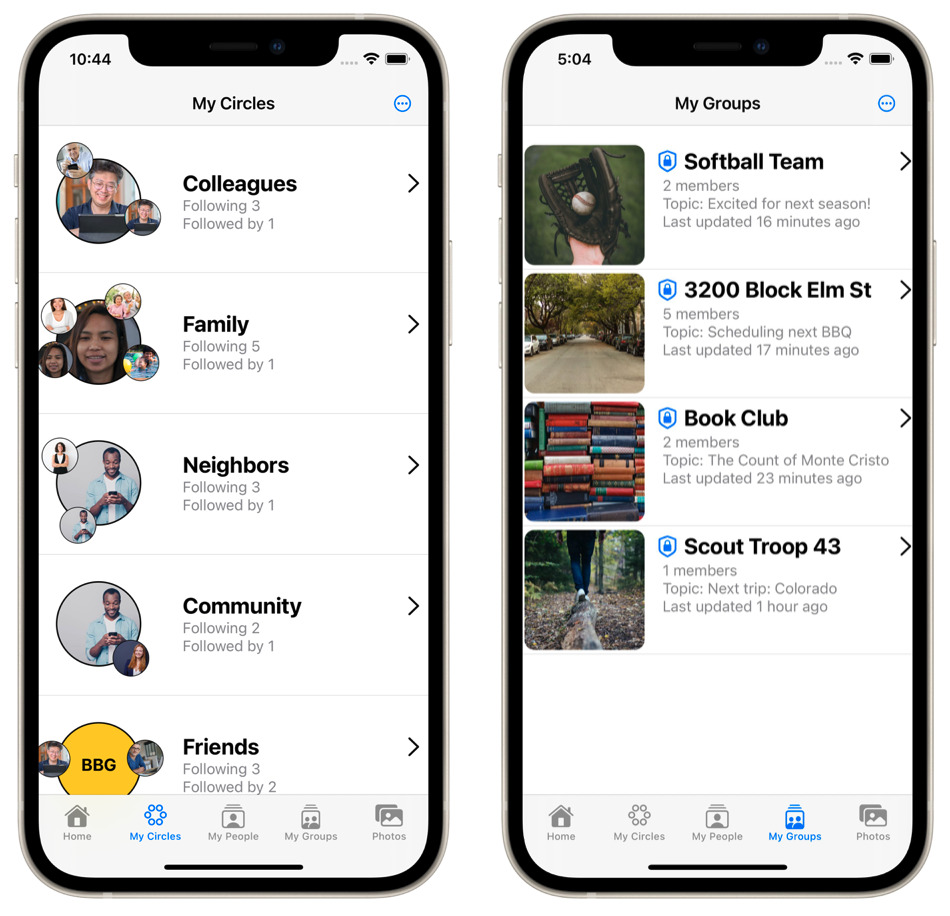
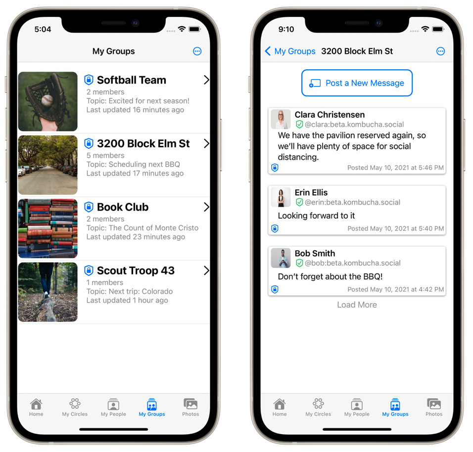
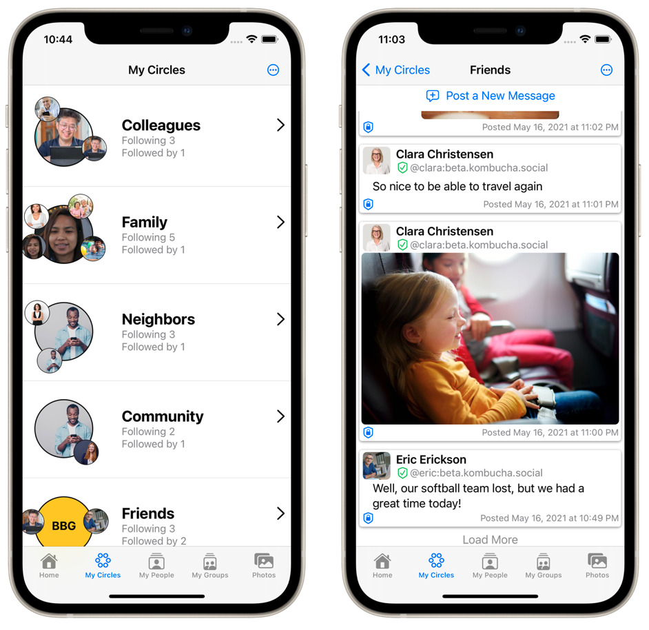

# Circles: E2E encrypted social networking, built on Matrix

Circles is a new kind of secure social sharing app.

You can think of it like an encrypted messenger that looks and feels like a social network.
Or you can think of Circles as a social network app where every post is encrypted from end to end.
Which is it really?  It's both, at the same time.

# Circles and Groups

In the Circles app, we support two different kinds of social structures:
circles and groups.

**Groups** are simpler, so let's talk about them first.

## Private Groups

A group in the Circles app works pretty much like a group anywhere else.
It has a well-defined set of members, and everyone who's in the group is
in the same group with everyone else.
Everyone in the group can see everything posted in the group.

Any organized group of people in the real world is probably a reasonable
fit for a group in the app.
For example:
* Your book club.
* Your softball team.
* The people who live on your block, or in your building.
* Your kid's preschool classroom.
  (Well, the parents and teachers anyway.  Preschoolers definitely shouldn't be on social networks!)

Any organized group of people with well-defined membership is probably a
reasonable fit for a **group** in the app.

## Secure Social Circles

**Circles** are loose, flexible, and overlapping, just like real, organic,
human social circles.

In the real world, if you and I are friends, then your set of friends is
probably not exactly the same as my set of friends.
And that's OK.

Similarly, if you and I are family, that doesn't mean that the set of people
who you consider to be family must be exactly the same people that I call
family.
For one thing, if you and I are blood relatives, then your in-laws are
probably totally unrelated to my in-laws, and vice versa.

And, again, that's totally OK.
That's how human relationships work.
Circles are our way of helping the technology catch up to the social reality.

A **circle** is a good fit for any type of relationship where every individual
has their own network of connections that's different from anyone else's.

